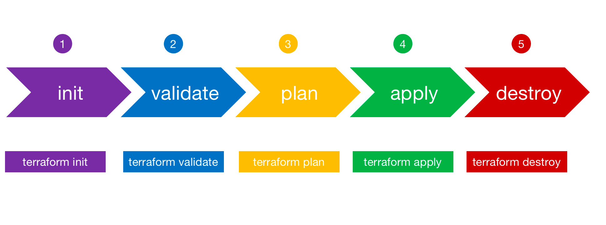

## Terraform简介

Terraform 是一个开源基础设施即代码工具，它提供一致的 CLI 工作流来管理数百个云服务。Terraform 通过编写声明式配置文件来操作API接口。

## Terraform工作原理

Terraform 通过其应用程序编程接口 (API) 在云平台和其他服务上创建和管理资源。Provider使 Terraform 能够通过可访问的 API 与几乎任何平台或服务一起工作。


## Terraform工作流




## Terraform中几个基本概念

#### provider

是一个与Open API直接交互的后端驱动，Terraform 就是通过Provider来完成对基础设施资源的管理的。不同的基础设施提供商都需要提供一个Provider来实现对自家基础设施的统一管理。目前Terraform目前支持超过160多种的providers，大多数云平台的Provider插件均已经实现了，阿里云对应的Provider为 alicloud

```
// 声明Provider
terraform {
  required_version = "1.1.7"
  required_providers {
    alicloud = {
      // 源地址
      source = "aliyun/alicloud"
      // 版本
      version = "1.162.0"
    }
  }
}
```

```
// 配置Provider
provider "alicloud" {
  version              = ">=1.56.0"
  region               = var.region
  access_key           = var.alicloud_access_key
  secret_key           = var.alicloud_secret_key
}
```

#### resource

在Terraform中，一个具体的资源或者服务称之为一个resource，比如一台ECS 实例，一个VPC网络，一个SLB实例。每个特定的resource包含了若干可用于描述对应资源或者服务的属性字段，通过这些字段来定义一个完整的资源或者服务，比如实例的名称（name），实例的规格（instance_type），VPC或者VSwitch的网段（cidr_block）等。
定义一个Resource的语法非常简单，通过 resource 关键字声明，如下：

```
# 定义一个ECS实例
resource "alicloud_instance" "default" {
  image_id        = "ubuntu_16_04_64_20G_alibase_20190620.vhd"
  instance_type   = "ecs.sn1ne.large"
  instance_name   = "my-first-vm"
  system_disk_category = "cloud_ssd"
  ...
}
```

除此之外，在Terraform中，一个资源与另一个资源的关系也定义为一个资源，如一块云盘与一台ECS实例的挂载，一个弹性IP（EIP）与一台ECS或者SLB实例的绑定关系。这样定义的好处是，一方面资源架构非常清晰，另一方面，当模板中有若干个EIP需要与若干台ECS实例绑定时，只需要通过Terraform的 count 功能就可以在无需编写大量重复代码的前提下实现绑定功能。

```
resource "alicloud_instance" "default" {
  count = 5
  ...
}
resource "alicloud_eip" "default" {
    count = 5
  ...
}
resource "alicloud_eip_association" "default" {
  count = 5
  instance_id = alicloud_instance.default[count.index].id
  allocation_id = alicloud_eip.default[count.index].id
}
```

#### datasource

对资源的查询是运维人员或者系统最常使用的操作，比如，查看某个region下有哪些可用区，某个可用区下有哪些实例规格，每个region下有哪些镜像，当前账号下有多少机器等，通过对资源及其资源属性的查询可以帮助和引导开发者进行下一步的操作。

除此之外，在编写Terraform模板时，Resource使用的参数有些是固定的静态变量，但有些情况下可能参数变量不确定或者参数可能随时变化。比如我们创建ECS 实例时，通常需要指定我们自己的镜像ID和实例规格，但我们的模板可能随时更新，如果在代码中指定ImageID和Instance，则一旦我们更新镜像模板就需要重新修改代码。
在Terraform 中，Data Source 提供的就是一个查询资源的功能，每个data source实现对一个资源的动态查询，Data Souce的结果可以认为是动态变量，只有在运行时才能知道变量的值。

Data Sources通过 data 关键字声明，如下

```
// Images data source for image_id
data "alicloud_images" "default" {
  most_recent = true
  owners      = "system"
  name_regex  = "^ubuntu_18.*_64"
}

data "alicloud_zones" "default" {
  available_resource_creation = "VSwitch"
  enable_details              = true
}

// Instance_types data source for instance_type
data "alicloud_instance_types" "default" {
  availability_zone = data.alicloud_zones.default.zones.0.id
  cpu_core_count    = 2
  memory_size       = 4
}

resource "alicloud_instance" "web" {
  image_id        = data.alicloud_images.default.images[0].id
  instance_type   = data.alicloud_instance_types.default.instance_types[0].id
  instance_name   = "my-first-vm"
  system_disk_category = "cloud_ssd"
  ...
}
```

#### state

保存资源关系及其属性文件的数据库, Terraform可以根据state跟踪托管资源，默认文件存储在本地（local），可以使用backend{}定义远程的存储（remote）。

```
terraform.tfstate   
terraform.tfstate.backup 
```

#### backend

存放 State 文件的载体

```
terraform {
  backend "oss" {
    access_key          = "LTAI5tJHLV6BfCH"
    secret_key          = "v3vlQPuaB9e7OXl"
    bucket              = "terraform-data"
    prefix              = "path/mystate"
    key                 = "terraform.tfstate"
    region              = "cn-beijing"
    tablestore_endpoint = "https://terraform-data.cn-beijing.ots.aliyuncs.com"
    tablestore_table    = "terraform_state"
  }
}
```

#### provisioner 

在机器上执行操作的组件

* Destroy-Time Provisioners

```
resource "aws_instance" "web" {
  # ...

  provisioner "local-exec" {
    when    = destroy
    command = "echo 'Destroy-time provisioner'"
  }
}
```

* Failure Behavior

```
resource "aws_instance" "web" {
  # ...

  provisioner "local-exec" {
    command    = "echo The server's IP address is ${self.private_ip}"
    on_failure = continue
  }
}
```

#### module

模块是多个配置文件（模板）的集合，最大限度保证Terraform配置的灵活性和可重用性。每一个Terraform配置至少有一个模块，即根模块（root模块）。模块之间可以相互依赖、相互引用。

module一般结构
```
$ tree minimal-module/
.
├── README.md
├── main.tf
├── variables.tf
├── outputs.tf
```

module调用方式
```
本地文件： "./module_name"
TF注册表： “hashicorp/consul”   hashicorp/aws"
GitHub：
- http "github.com/hashicorp/example"
- ssh "git@github.com:hashicorp/example.git"
bucket: "bitbucket.org/hashicorp/terraform-consul-aws"
通用Git: 
- http: "git::https://example.com/vpc.git"
- ssh: "git::ssh://username@example.com/storage.git"
```

## 实战案例

需求: aws上创建一台ec2, 并在启动时候安装nginx, 输出nginx访问地址


思考？
1. 如何代码重构, 例如修改资源标识符 ？
2. 如何将手动创建资源纳入到terraform ？
3. 多人协作注意事项
4. 代码如何复用 ?
4. 自动化测试 ?
5. 代码结构 ?
6. 状态存储 ？


## 代码结构演进

#### 单体Terraform
```
.
├── main.tf
├── outputs.tf
└── variables.tf
```

#### 稍为复杂点的
```
.
├── Makefile
├── README.md
├── db.tf
├── gateway.tf
├── main.tf
├── securitygroup.tf
├── subnet.tf
├── terraform.tfvars
├── variables.tf
└── vpc.tf
```

问题:

- 栈过大，管理的资源过多，每次执行plan、apply时间很长
- 爆炸半径过大，一旦犯错，例如错误地执行了destroy，会将整个基础设施全部抹除


#### 多层单体Terraform
- 拆分状态文件
```
.
├── app
│   ├── main.tf
│   ├── outputs.tf
│   ├── terraform.tfstate
│   └── variables.tf
├── mysql
│   ├── main.tf
│   ├── outputs.tf
│   ├── terraform.tfstate
│   └── variables.tf
└── vpc
    ├── main.tf
    ├── outputs.tf
    ├── terraform.tfstate
    └── variables.tf
```

#### 正式环境
```
.
├── prod
│   ├── app
│   │   ├── main.tf
│   │   ├── outputs.tf
│   │   ├── terraform.tfstate
│   │   └── variables.tf
│   ├── mysql
│   │   ├── main.tf
│   │   ├── outputs.tf
│   │   ├── terraform.tfstate
│   │   └── variables.tf
│   └── vpc
│       ├── main.tf
│       ├── outputs.tf
│       ├── terraform.tfstate
│       └── variables.tf
├── qa
│   ├── app
│   │   ├── main.tf
│   │   ├── outputs.tf
│   │   ├── terraform.tfstate
│   │   └── variables.tf
│   ├── mysql
│   │   ├── main.tf
│   │   ├── outputs.tf
│   │   ├── terraform.tfstate
│   │   └── variables.tf
│   └── vpc
│       ├── main.tf
│       ├── outputs.tf
│       ├── terraform.tfstate
│       └── variables.tf
└── stage
    ├── app
    │   ├── main.tf
    │   ├── outputs.tf
    │   ├── terraform.tfstate
    │   └── variables.tf
    ├── mysql
    │   ├── main.tf
    │   ├── outputs.tf
    │   ├── terraform.tfstate
    │   └── variables.tf
    └── vpc
        ├── main.tf
        ├── outputs.tf
        ├── terraform.tfstate
        └── variables.tf
```


#### 使用Terraform Module
```
module "vpc" {
  source = "example/exampleapp/vpc"
  version = "1.2.0"
}
module "vpc" {
  source = "git::https://example.com/vpc.git?ref=v1.2.0"
}
```

```
└── live
    ├── prod
    │   ├── app
    │   │   └── main.tf
    │   ├── mysql
    │   │   └── main.tf
    │   └── vpc
    │       └── main.tf
    ├── qa
    │   ├── app
    │   │   └── main.tf
    │   ├── mysql
    │   │   └── main.tf
    │   └── vpc
    │       └── main.tf
    └── stage
        ├── app
        │   └── main.tf
        ├── mysql
        │   └── main.tf
        └── vpc
            └── main.tf
```


#### 使用terragrunt

- 减少重复代码

```
terraform {
  source = "git::https://example.com/modules.git//vpc?ref=v1.2.0"
}

inputs = {
  cidr = "10.0.0.0/16"
  name = "terragrunt_vpc"
}

include {
  path = find_in_parent_folders()
}
```

```
└── live
    ├── prod
    │   ├── terragrunt.hcl
    │   ├── app
    │   │   └── terragrunt.hcl
    │   ├── mysql
    │   │   └── terragrunt.hcl
    │   └── vpc
    │       └── terragrunt.hcl
    ├── qa
    │   ├── terragrunt.hcl
    │   ├── app
    │   │   └── terragrunt.hcl
    │   ├── mysql
    │   │   └── terragrunt.hcl
    │   └── vpc
    │       └── terragrunt.hcl
    └── stage
        ├── terragrunt.hcl
        ├── app
        │   └── terragrunt.hcl
        ├── mysql
        │   └── terragrunt.hcl
        └── vpc
            └── terragrunt.hcl
```

进一步精简命令行flag

```
terraform {
  extra_arguments "backend_config" {
    commands = [
      "init",
    ]
    arguments = [
      "-backend-config=address=${get_env("CONSUL_BACKEND_ADDRESS")}",
      "-backend-config=path=${get_env("CONSUL_BACKEND_PATH")}",
      "-backend-config=scheme=${get_env("CONSUL_BACKEND_SCHEME")}"
    ]
  }

  extra_arguments "retry_lock" {
    commands = [
      "init",
      "apply",
      "refresh",
      "import",
      "plan",
      "taint",
      "untaint"
    ]
    arguments = [
      "-lock-timeout=20m"
    ]
  }
}
```

参考文档:

- 最佳实战: https://cloud.google.com/docs/terraform/best-practices-for-terraform
- 代码结构参考: https://www.terraform-best-practices.com/examples
- code学习示例: https://github.com/hashicorp?q=learn-terraform-aws&type=all&language=&sort=
